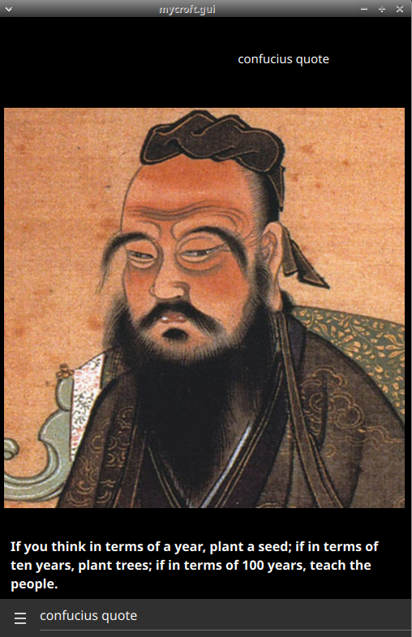

#  Confucius Quotes

## About
This OpenVoiceOS skill shares quotes and biographical facts about the philosopher Confucius. It answers questions about his life, his death, and his teachings, and it speaks a quote on request. On a device with a screen, the skill shows a portrait of Confucius next to the spoken text.



## Install
Install the skill with pip:
```bash
pip install ovos-skill-confucius-quotes
```

## Examples
Say one of these phrases to your assistant:
* "Who is Confucius"
* "Quote from Confucius"
* "When was Confucius born"
* "When did Confucius die"

## Related projects
* [OpenVoiceOS/ovos-workshop](https://github.com/OpenVoiceOS/ovos-workshop) — the skill framework this skill builds on.
* [OpenVoiceOS/ovos-core](https://github.com/OpenVoiceOS/ovos-core) — the assistant that loads and runs this skill.

## Credits
JarbasAl

## Category
**Information**

## Tags
#quotes
